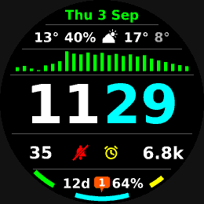

# Dashboard watch face

A dense information watch face for the **fenix 8 Solar 47 mm**, built to match
the reference design: date, weather, a configurable history graph, the time, a
status row, a battery row, and three progress arcs around the bottom edge.



*(rendered by `tools/preview.py`, not the simulator — see [Previewing](#previewing-without-the-simulator))*

The design this was built to, and the original brief behind each row, are in
[`docs/brief.md`](docs/brief.md).

This lives beside the existing Protomolecule face in the repository root; the
two projects are independent and neither one's build touches the other.

---

## What is on the face

| Row | Content |
| --- | --- |
| 1 | Day of week, day of month, month — green |
| 2 | Current temperature · chance of precipitation · today's condition · today's high · today's low |
| 3 | Configurable history graph (heart rate, Body Battery, stress, pressure, elevation or Pulse Ox) |
| 4 | Time — hours white, minutes cyan |
| 5 | Body Battery · do-not-disturb (red on / grey off) · alarm (yellow on / grey off) · steps (`6.8k` past 1000) |
| 6 | Battery days remaining · notification badge (orange with a count, grey and empty at zero) · battery percentage |
| Arcs | left: Body Battery, filling upwards · centre: device battery, filling out of 6 o'clock both ways · right: daylight left, full at sunrise and empty at sunset |

Anything the watch cannot supply is simply left out: no weather sync means the
weather row shows `--`, a device with no Body Battery sensor gets no left arc,
and so on. Nothing throws.

### Settings

Two settings, changeable **on the watch** (hold the menu button on the face →
the face's settings) or from Garmin Connect:

- **Graph** — which series the graph plots.
- **Graph range** — how far back it reaches, 2 to 24 hours (default 4).

Both are stored as app properties (`graphSource`, `graphHours`); the on-watch
menu and the Connect settings drive the same two values.

---

## Building a .prg

### 1. Install the Connect IQ SDK

The compiler is not on any package registry — it ships only in Garmin's SDK,
which is behind a licence click-through at
<https://developer.garmin.com/connect-iq/sdk/>.

The path of least resistance is the **Monkey C extension for VS Code**
(publisher: Garmin). Install it, then run *Connect IQ: Install the Connect IQ
SDK* from the command palette. It fetches the SDK **and** the per-device files
(a separate download that `monkeyc -d <device>` needs; the SDK zip alone is not
enough). Use *Connect IQ: Download Devices* and tick **fenix 8 Solar 47mm**.

Doing it by hand instead: download the SDK Manager from the link above, use it
to install an SDK and the device, and add the SDK's `bin/` to `PATH`.

### 2. Build

```sh
cd dashboard
./build.sh                    # fenix8solar47mm, release build → bin/dashboard-fenix8solar47mm.prg
./build.sh fenix847mm         # some other device in manifest.xml
./build.sh fenix8solar47mm -d # debug build, needed by the simulator
```

`build.sh` finds the SDK (via `PATH`, `CIQ_SDK`, or the SDK Manager's default
install directory), generates a signing key on first run, and invokes the
compiler. The underlying command is just:

```sh
monkeyc -o bin/dashboard-fenix8solar47mm.prg \
        -f monkey.jungle \
        -y developer_key.der \
        -d fenix8solar47mm \
        -r -w
```

From VS Code you can skip the script: *Connect IQ: Build Current Project*.

### 3. Put it on the watch

Connect the watch over USB, mount it, and copy the `.prg` into `GARMIN/APPS/`.
Eject and reboot the watch; the face appears under *Watch Face → Connect IQ*.

For the store instead of side-loading you want a packaged `.iq`
(`monkeyc -e -o dashboard.iq …`), which builds every device in `manifest.xml`
at once and therefore needs all of them installed locally.

### About the developer key

Every `.prg` is signed with a 4096-bit RSA key. `build.sh` creates
`developer_key.der` the first time it runs (gitignored). Any key works for
side-loading, but the Connect IQ store ties your published app to the key that
signed it — so **back this file up** if you ever intend to publish, and never
commit it.

### Continuous integration

`.github/workflows/dashboard.yml` builds the `.prg` and uploads it as a run
artifact. Because Garmin publishes no stable unauthenticated download for the
SDK or the device files, the workflow needs two repository variables pointing at
copies you host yourself (`CIQ_SDK_URL`, `CIQ_DEVICES_URL`); the file's header
comment has the details. Without them the workflow warns and skips rather than
failing.

---

## Previewing without the simulator

`tools/preview.py` re-implements the face's geometry in Python and renders a
PNG:

```sh
pip install Pillow                       # plus a TrueType font: apt-get install fonts-dejavu-core
python3 tools/preview.py preview.png                     # fenix8solar47mm
python3 tools/preview.py --device fenix8solar51mm out.png
python3 tools/preview.py --all                           # tools/preview-<device>.png for each
python3 tools/preview.py --sleep out.png                 # the burn-in / sleep face
python3 tools/preview.py --scale 3 out.png               # 3x nearest-neighbour zoom
```

It is a drawing mock, not an emulator — fixed sample values, and DejaVu Sans
Bold standing in for the proprietary Garmin system fonts. What it gets right:
it renders at each device's real resolution, and for the transflective (MIP)
devices it snaps every pixel to the 64-colour panel palette, so a colour that
would dither on the watch dithers here too.

The colour palette and the `Layout` fractions are **read out of
`source/Theme.mc`** when the script runs, so those never drift. The per-row
geometry inside the `draw*` methods is still a hand copy of
`source/DashboardView.mc` (and `Arcs.mc` / `Graph.mc` / `Icons.mc`) — keep the
two in step when you edit a `draw` method.

The real check is still `monkeydo bin/dashboard-fenix8solar47mm.prg
fenix8solar47mm` against a debug build.

---

## How the code is put together

Monkey C is Garmin's language for Connect IQ: object-oriented, garbage
collected, duck-typed with **optional** static types (`as Number`), and
compiled to bytecode for a small VM on the watch. A few properties of it shape
everything here:

- **Memory is the binding constraint.** A watch face gets a fixed, small heap.
  That is why there are no bitmap assets: every icon is drawn from primitives in
  `source/Icons.mc` and scales with the screen instead.
- **`onUpdate` runs once a minute** on a memory-in-pixel screen like the
  fenix 8 Solar, so the face redraws itself completely each time and keeps no
  state between frames. There is no partial-update path because nothing on the
  face ticks per second.
- **Capabilities differ per device**, so every optional API is behind a
  `has` check (`SensorHistory has :getBodyBatteryHistory`) and the risky reads
  sit in `try`/`catch`. A missing sensor degrades the face; it never crashes it.
- **Resources are compiled in**, referenced through the generated `Rez` symbol
  (`Rez.Strings.AppName`). `manifest.xml` lists the target devices and the
  permissions; `monkey.jungle` is the build file.

### Files

```
manifest.xml                     app id, target devices, permissions
monkey.jungle                    build configuration
source/
  DashboardApp.mc                AppBase: entry point, settings view
  DashboardView.mc               the face — all drawing happens here
  Theme.mc                       colour palette + the vertical layout fractions
  Fonts.mc                       picks the largest system font that fits a row
  Data.mc                        every read of watch state, all of it defensive
  Graph.mc                       the history graph
  Arcs.mc                        the three bottom arcs
  Icons.mc                       weather / DND / alarm / notification, drawn as vectors
  settings/DashboardSettings.mc  the on-watch settings menu
resources/
  strings/strings.xml            user-visible text
  settings/properties.xml        property defaults
  settings/settings.xml          the Garmin Connect settings screen
  drawables/                     launcher icon
tools/preview.py                 static preview renderer
build.sh                         SDK lookup, key generation, compile
```

### Layout

`source/Theme.mc` holds the whole vertical layout as fractions of the screen
height, measured off the reference design. Everything else derives from the
screen size at run time, so the face is not tied to 260×260: the separator lines
follow the chord of a circle just inside the bezel, the graph fits as many bars
as the width allows, and `Fonts.fit` measures the built-in system fonts and
keeps the largest that fits each row.

### Colours

All colours are from the 64-colour palette a MIP screen renders natively — each
channel is one of `0x00`, `0x55`, `0xAA`, `0xFF`. Anything else gets dithered by
the firmware and looks grainy on the watch.

### Known deviations from the reference

- **The digits are Garmin's system number font**, not the wide bold face in the
  reference, which is a custom bitmap font. Adding one means generating a
  BMFont `.fnt` + PNG pair and a `resources/fonts/fonts.xml` — the
  `resources-round-260x260/fonts/` directory of the Protomolecule project next
  door is a working example of the format. `Fonts.time()` in `source/Fonts.mc` is
  where you would slot it in.
- **The weather condition icons are approximations** grouped into eight shapes
  (sun, partly cloudy, cloudy, rain, snow, storm, fog, wind); Connect IQ reports
  around fifty distinct conditions.
- **Daylight needs a position.** It comes from the last activity fix, falling
  back to the weather station's location. Until the watch has one, the right
  arc stays empty.
