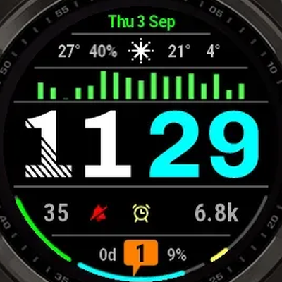

# Original brief

The request this face was built from, kept verbatim so the intent behind each
row stays available. `reference-design.webp` is the image it linked to;
`reference-face.png` is the watch face cropped out of it.

The link in the original was an expiring presigned S3 URL whose query string
carried an AWS signature — that signature is stripped below, since it is a
credential and does not belong in git. The image itself is in this directory.

---

> repository is a watchface for garmin watch.
>
> 1. i need you to research how the language works, how to build it and get me
>    final .prg file i can upload to a watch.
> 2. there is some
> 3. this is the watchface i want to have as a result for fenix 8 solar 47mm:
>    `https://…r2.cloudflarestorage.com/wfb-private-users-prod/uploads/users/design/ebd/ebd21d9ad5b7c/ebd21d9ad5b7c.thumb.webp`
>    (see `reference-design.webp`)
>    1. 1st line - obvious: date and day of week
>    2. 2nd line is current temperature, precipitation chance for today,
>       conditions icon for today overall, high low temperatures for today.
>    3. third line i was thinking about configurable(from watch itself) graph:
>       either hr histoy last 4-6 hr, or body battery history, or atmospheric
>       pressure etc.
>    4. the time itself
>    5. then body battery, dnd (red on, gray off), alarm clock(yellow on, gray
>       off), steps(short variation if greater than 1000)
>    6. watch battery on either side(percent and days left), noticifations count
>       in the middle(notification icon turns gray and shows no number if it's
>       zero)
>    7. the arcs on the bottom:
>       1. left: body battery, fills from bottom to top.
>       2. center: device battery, fills from center outwards,
>       3. right: daylight, appears 100% at sunrise, drains down until sunset
>
> 1. ideally it has to be configurable, at this stage graph is enough.
> 2. garmin docs https://developer.garmin.com/connect-iq/monkey-c/

---

## Notes on the reading of it

- **Point 2 was cut off mid-sentence** ("there is some") and was never
  clarified. If something in the face looks unaccounted for, that is probably
  where it was going.
- **"configurable from the watch itself"** drove `getSettingsView()` in
  `source/DashboardApp.mc` and the menu in `source/settings/`, not just the
  Garmin Connect settings screen.
- **The hatched first digit** in the reference is a texture from the design
  tool, not a data indicator. It is rendered solid here.
