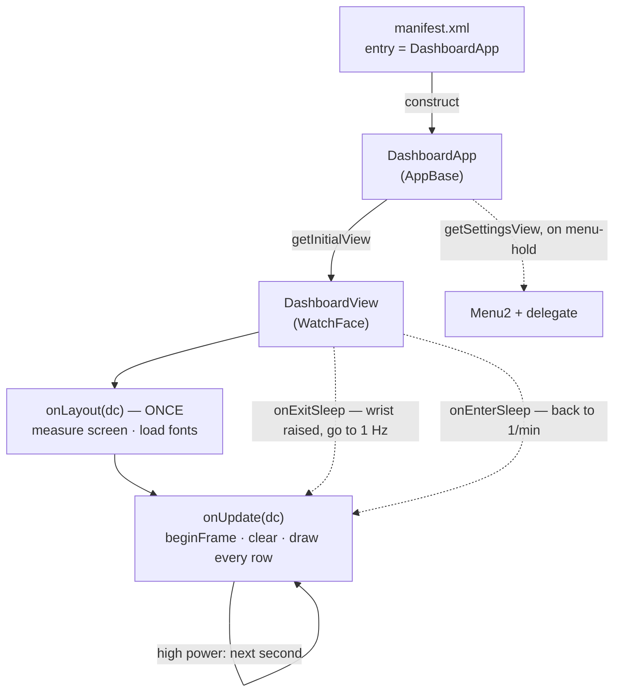
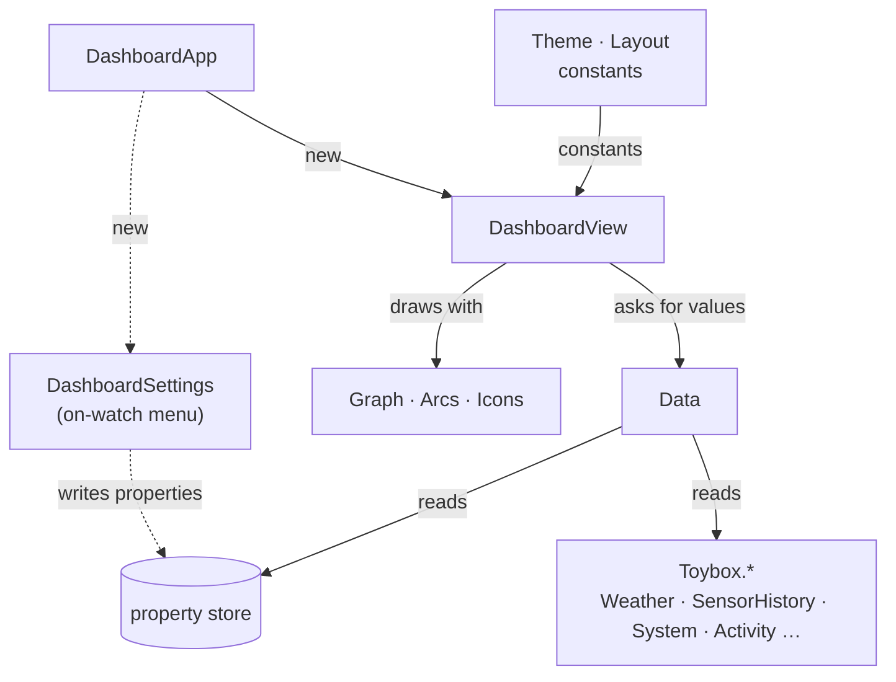
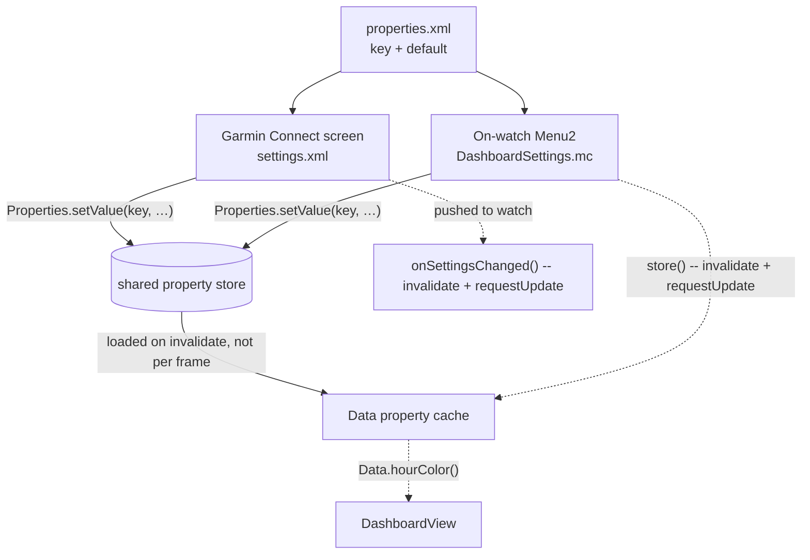

# Dashboard face internals

How this face is put together — the entry point, the calls the firmware makes
and when, the job each file owns, and the handful of recipes that cover almost
every change. The project is the repository root.

Pair this with [`README.md`](../README.md) (the *why* behind each row) and
[`BUILDING.md`](../BUILDING.md) (how to compile and run it). When this doc and
the code disagree, the code is right.

---

## Contents

1. [The shape of the thing](#1-the-shape-of-the-thing)
2. [Entry point & lifecycle](#2-entry-point--lifecycle)
3. [One pass per frame](#3-one-pass-per-frame)
4. [What each file owns](#4-what-each-file-owns)
5. [Geometry: fractions & the round screen](#5-geometry-fractions--the-round-screen)
6. [Fonts](#6-fonts)
7. [Resources and the `Rez` symbol](#7-resources-and-the-rez-symbol)
8. [Settings, on two fronts](#8-settings-on-two-fronts)
9. [Reading watch state without crashing](#9-reading-watch-state-without-crashing)
10. [Refresh: what updates when](#10-refresh-what-updates-when)
11. [The preview mirror](#11-the-preview-mirror)
12. [Recipes](#12-recipes)
13. [Monkey C gotchas](#13-monkey-c-gotchas)
14. [The build & test loop](#14-the-build--test-loop)

---

## 1. The shape of the thing

A Connect IQ watch face is a small program compiled to bytecode for a virtual
machine that runs on the watch. Two facts about that VM shape every decision in
this codebase.

- **Memory is fixed and small.** A watch face gets a few tens of kilobytes of
  heap. That is why there are almost no bitmaps — every icon in `Icons.mc` is
  drawn from circles, lines and polygons, and the only image resource is the
  clock font (digits only).
- **`onUpdate` runs once a minute — except when it runs once a *second*.** The
  device has two power modes. In low power it calls `onUpdate` at the top of
  each minute. Raising your wrist puts it in **high power mode, where
  `onUpdate` is called every second** for roughly ten seconds before it drops
  back. The face is redrawn in full every time and keeps *no* frame state.

Everything else — the tiered caching in `Data`, the defensive reads, the
geometry expressed as fractions, the palette limited to 64 colours — follows
from those two.

> The 1 Hz burst is the single most important fact for anyone touching this
> code. Anything you call straight from `onUpdate` runs up to **sixty times more
> often** than the number behind it can change. See
> [§10](#10-refresh-what-updates-when).

---

## 2. Entry point & lifecycle

`manifest.xml` names the entry class: `entry="DashboardApp"`. That class extends
`Application.AppBase` and is the firmware's single handle on the app. It does
almost nothing itself — it hands back views.

```monkeyc
// source/DashboardApp.mc
class DashboardApp extends Application.AppBase {
  function getInitialView() {
    return [new DashboardView()];               // the face
  }
  function getSettingsView() {
    return [new DashboardSettingsMenu(),         // the on-watch menu
            new DashboardSettingsDelegate()];
  }
  function onSettingsChanged() as Void {
    Data.invalidateProperties();                 // Connect changed a property
    WatchUi.requestUpdate();                     // -> reload and redraw
  }
}
```

`getInitialView()` returns the face. `DashboardView` extends
`WatchUi.WatchFace`, and the firmware drives it through a fixed set of
callbacks:



`onLayout` fires once when the face is shown. `onUpdate` then fires **at the top
of every minute in low power mode, and every second in high power mode** — which
a wrist-raise gesture triggers, for about ten seconds, before the device drops
back to low power and calls `onEnterSleep`.

`onEnterSleep` / `onExitSleep` are the signal for which mode you are in. This
face uses them only to pick the reduced burn-in variant on AMOLED devices; the
manifest currently targets MIP only, so that branch is dead code kept for later.

### onLayout — run once, cache everything

`onLayout(dc)` is where the face learns its size. It stashes the screen metrics
and picks the fonts, so `onUpdate` never has to:

```monkeyc
// source/DashboardView.mc
function onLayout(dc as Graphics.Dc) as Void {
  mWidth   = dc.getWidth();
  mHeight  = dc.getHeight();
  mCenterX = mWidth / 2;
  mCenterY = mHeight / 2;
  mRadius  = (mWidth < mHeight ? mWidth : mHeight) / 2;

  mTimeFont    = WatchUi.loadResource(Rez.Fonts.ClockFont);  // bitmap
  mDateFont    = Graphics.FONT_XTINY;
  mWeatherFont = Graphics.FONT_XTINY;
  mSmallFont   = Graphics.FONT_XTINY;
  mRowFont     = Graphics.FONT_TINY;
  mBadgeFont   = Graphics.FONT_TINY;
}
```

---

## 3. One pass per frame

`onUpdate` is the whole face. It opens a frame in `Data`, clears the screen,
then calls one drawing function per row, top to bottom. Nothing is retained
between frames.

```monkeyc
// source/DashboardView.mc — onUpdate(), condensed
Data.beginFrame();              // one clock/settings/stats snapshot for the frame

dc.setColor(Theme.TEXT, Theme.BACKGROUND);
dc.clear();

if (mBurnInProtection && mAsleep) { drawSleepFace(dc); return; }

var bodyBattery = Data.bodyBattery();   // wanted by two rows; read once

separator(dc, Layout.SEP_1_Y);          // five hairlines that follow the round edge
separator(dc, Layout.SEP_2_Y);
// ... SEP_3, SEP_4, SEP_5

drawDate(dc);
drawWeather(dc);
drawGraph(dc);
drawTime(dc, 0);
drawStatusRow(dc, bodyBattery);
drawArcs(dc, bodyBattery);
drawBatteryRow(dc);                     // after the arcs — the badge sits on top of them
```

**Always draw the whole screen.** Garmin's guidance is to assume nothing of the
previous frame survives, and returning early from `onUpdate` without drawing
blanks the display on some devices. Do not try to save power by skipping the
draw — save it by not *re-reading* data that cannot have changed, which is what
`Data`'s cache tiers are for.

Every vertical position on the face is a constant in the `Layout` module,
expressed as a fraction of screen height. Top to bottom:

| Element | Vertical anchor (`Layout.*`) |
| --- | --- |
| `drawDate` | `DATE_Y` |
| hairline | `SEP_1_Y` |
| `drawWeather` | `WEATHER_Y` |
| hairline | `SEP_2_Y` |
| `drawGraph` | `GRAPH_TOP_Y` … `GRAPH_BOTTOM_Y` |
| hairline | `SEP_3_Y` |
| `drawTime` | `TIME_Y` |
| hairline | `SEP_4_Y` |
| `drawStatusRow` | `STATUS_Y` |
| hairline | `SEP_5_Y` |
| `drawBatteryRow` | `BATTERY_Y` |
| `drawArcs` | radius from `mRadius`, hugging the bezel |

(The five separators are all drawn first as a batch; the table is the visual
order, not the call order.)

---

## 4. What each file owns

The `source/` tree is small and each file has one job. Rule of thumb: **drawing
goes in the view and its helpers; every read of watch state goes in `Data`;
every tunable number goes in `Theme`.**

| File | Owns | You touch it when… |
| --- | --- | --- |
| `DashboardApp.mc` | The `AppBase` entry class: initial view, settings view, settings-changed hook. | Almost never. |
| `DashboardView.mc` | The face. `onLayout`, `onUpdate`, one `draw*` function per row. All positioning logic. | Changing what a row shows or where its pieces sit. |
| `Theme.mc` | Two modules of constants: `Theme` (colours) and `Layout` (vertical fractions, arc angles, pen widths). | Recolouring, or moving/resizing any row or the arcs. |
| `Data.mc` | Every read of watch state — sensors, weather, battery, activity, properties — each one guarded, and each on a refresh tier (§10). Plus the `GraphSource` enum. | Adding a new reading, or changing how one is fetched, cached or formatted. |
| `Graph.mc` | The history graph: how many bars fit, bar geometry, value→height scaling. | Retuning the graph's look. |
| `Arcs.mc` | The three bottom arcs: grey track + coloured fill, the sweep maths, pen widths. | Changing arc length, thickness, direction, or colour rules. |
| `Icons.mc` | Every icon, drawn from primitives: weather (8 shapes), DND, alarm, notification badge. Plus `forCondition()`, the weather-code lookup. | Editing an icon shape, or remapping a weather condition. |
| `settings/DashboardSettings.mc` | The on-watch menu: item list, the generic list-picker (`OptionMenu` / `OptionDelegate`), writing the chosen value back to a property. | Adding or changing a setting reachable from the watch. |



`Data` is the only module that touches a `Toybox` watch API. The view never
calls a sensor directly — it asks `Data`, which either returns a value or
returns `null` and the view leaves that element out.

---

## 5. Geometry: fractions & the round screen

Nothing is hard-coded to 260&nbsp;&times;&nbsp;260. The whole vertical layout
lives in the `Layout` module as fractions of screen height, measured off the
reference design:

```monkeyc
// source/Theme.mc — module Layout
const DATE_Y   as Float = 0.066;   // row centres, top -> bottom
const SEP_1_Y  as Float = 0.112;   // separator hairlines
// WEATHER_Y, SEP_2_Y, GRAPH_TOP_Y, GRAPH_BOTTOM_Y, SEP_3_Y …
const TIME_Y   as Float = 0.507;
// … SEP_4_Y, STATUS_Y, SEP_5_Y, BATTERY_Y

const SEPARATOR_RADIUS as Float = 0.94;  // circle the hairline ends ride

// Arc tracks: Garmin degrees run counter-clockwise from 3 o'clock,
// so 270 is straight down.
const ARC_LEFT_FROM  as Number = 237;
const ARC_LEFT_TO    as Number = 205;
// … ARC_CENTER, ARC_CENTER_SPREAD, ARC_RIGHT_*, ARC_TRACK_PEN, ARC_FILL_PEN, ARC_EDGE_INSET
```

At draw time a fraction becomes a pixel: `Layout.TIME_Y * mHeight`. Horizontal
placement inside a row uses fractions of `mWidth` (`mWidth * 0.335`) or is
measured from the text itself with `dc.getTextDimensions(...)`.

### chord() — the taper

The screen is round, so the usable width shrinks toward the top and bottom.
`chord(y)` returns the half-width available at a given height, following a
circle just inside the bezel:

```monkeyc
// source/DashboardView.mc
hidden function chord(y as Numeric) as Numeric {
  var r  = mRadius * Layout.SEPARATOR_RADIUS;
  var dy = y - mCenterY;
  var squared = r * r - dy * dy;
  return squared <= 0 ? 0 : Math.sqrt(squared);
}
```

That is how the separators know how wide to be, and how the graph frames itself
under the separator above it.

---

## 6. Fonts

Connect IQ has no runtime font rasteriser, so you get two options: the built-in
system fonts, or a bitmap font shipped as an image atlas.

- **Everything except the clock is a system font** — `Graphics.FONT_XTINY` for
  the date, weather and battery rows, `Graphics.FONT_TINY` for Body Battery,
  steps and the badge number. The firmware sizes those per device, so they need
  no per-screen handling.
- **The clock is Chivo**, baked into an AngelCode bitmap font — a `.fnt`
  descriptor plus a `_0.png` glyph atlas — in `resources/fonts/`, declared in
  `fonts.xml` as `Rez.Fonts.ClockFont`. Only the digits and a space are
  included. Regenerate it from the vendored TTF:

```sh
# em size is for a 260 px screen; weight 100-900
python3 tools/make_clock_font.py --px 95 --weight 700
```

> **Constraint.** A bitmap font is one fixed pixel size. It is generated for the
> 260&nbsp;px device; a screen of another size needs its own
> `resources-round-<w>x<h>/fonts/` directory with a rerun at a scaled `--px`.
> This is why the manifest currently targets only the two 260/280 solar models.

---

## 7. Resources and the `Rez` symbol

Anything under `resources/` is compiled into the app and reached through a
generated module called `Rez`. The XML `id` becomes the symbol name:

| File | Root tag | Reached as |
| --- | --- | --- |
| `strings/strings.xml` | `<strings>` | `Rez.Strings.AppName` |
| `fonts/fonts.xml` | `<fonts>` | `Rez.Fonts.ClockFont` |
| `drawables/drawables.xml` | `<drawables>` | `Rez.Drawables.LauncherIcon` |
| `settings/properties.xml` | `<properties>` | `Properties.getValue("graphHours")` |
| `settings/settings.xml` | `<settings>` | Garmin Connect UI (not code) |

> **Gotcha.** Every `Rez.Strings.X` you reference in code must exist in
> `strings.xml`, or the build fails with `Undefined symbol ':X'`. This is the
> single most common first-build error when adding a setting.

`manifest.xml` ties it together: the app id, the target `<iq:product>` list, the
permissions (`SensorHistory` here), and `launcherIcon`. `monkey.jungle` is the
build file — it points at the manifest and sets `sourcePath` / `resourcePath` to
`source` / `resources` (the defaults, stated explicitly).

---

## 8. Settings, on two fronts

A setting is just an app **property** — a key/value pair in the persistent
store. Two separate UIs write the same keys, and the face reads them through
`Data`. Nothing is shared between the UIs except the key name.



The Connect screen edits are pushed to the watch and fire `onSettingsChanged()`;
the on-watch menu writes directly and calls `WatchUi.requestUpdate()` itself.
Either way the next `onUpdate` picks up the new value.

> **Both write paths must call `Data.invalidateProperties()`.** `Data` caches
> the property values rather than re-reading them every frame, so a write that
> does not invalidate simply will not take effect. The app does it in
> `onSettingsChanged()`; the on-watch menu does it in `SettingsMenu.store()`.
> `onSettingsChanged` fires **only** for values pushed from Garmin Connect — it
> is not called for an on-watch edit.

The on-watch menu leans on one reusable pair: `OptionMenu` shows a flat list
with a dot on the current choice, and `OptionDelegate` stores the picked value
and updates the parent item's sub-label. Adding a list-type setting is mostly
wiring, not new UI.

Current settings: `graphSource`, `graphHours`, `hourColor`, `minuteColor`. The
colour values are packed `0xRRGGBB` stored as decimal, validated against
`Data.clockColorChoices()`.

---

## 9. Reading watch state without crashing

Devices differ, sensors go missing, weather may not have synced, a permission
may be denied. **Every read in `Data.mc` is behind a guard** — a capability
check, a null check, or a `try` — and returns `null` on failure. The view
treats `null` as "leave this element out".

```monkeyc
// source/Data.mc — the pattern
function daylightRemaining() as Float? {
  if (!(Toybox has :Weather) || !(Weather has :getSunrise)) {
    return null;                         // API not on this device
  }
  var location = position();
  if (location == null) { return null; } // no position fix yet
  try {
    // … compute fraction of daylight left …
  } catch (e) {
    return null;                         // anything unexpected -> drop it
  }
}
```

`X has :y` is the capability check. It works for modules
(`Toybox has :SensorHistory`), for functions
(`SensorHistory has :getBodyBatteryHistory`), and for object members
(`settings has :doNotDisturb`) — and the compiler understands it as a guard, so
code inside the check may use APIs that don't exist on every device.

Weather conditions are matched on **raw integers** in `Icons.forCondition()`,
with the `Weather.CONDITION_*` name in a comment on each line. That's
deliberate: there are around fifty of them and a device SDK missing one of the
rare ones would break the build if referenced by name.

---

## 10. Refresh: what updates when

Three things interact: how often the firmware calls `onUpdate`, how often `Data`
lets a given read actually happen, and how often the underlying number can
change at all.

### How often `onUpdate` runs

| Mode | Cadence | Entered by |
| --- | --- | --- |
| Low power | once a minute, on the minute | the default; `onEnterSleep` fires |
| **High power** | **once a second**, ~10 s | wrist raise / gesture / button; `onExitSleep` fires |

That 1 Hz burst is why `Data` caches. Read naively, a gesture would walk the
sensor history ten times in ten seconds to redraw a graph whose bars are eight
minutes wide.

### The three cache tiers in `Data`

| Tier | What | Refresh |
| --- | --- | --- |
| **Per frame** | clock; `DeviceSettings` (DND, alarm, notification count); `SystemStats` (battery %); step count | every `onUpdate` — so a gesture shows them live |
| **`SLOW_TTL`** (5 min) | graph series, Body Battery, weather, battery-days estimate | at most once per TTL |
| **Per day / per change** | sunrise & sunset, the date string; app properties | once a day; properties on a settings change |

The per-frame tier is deliberately the set the user notices: raise your wrist
and the notification badge, DND, alarm and steps are current to the second. The
`DeviceSettings` and `SystemStats` snapshots are taken **once** in
`Data.beginFrame()` and shared by every row, rather than each row calling the
system for itself.

Nothing caches to `Application.Storage` — that hits the filesystem and would
cost more than it saves. It is plain in-memory state, bounded, rebuilt on launch.

**No gesture throttle is needed.** A repeated or false-positive wrist raise
costs one extra draw and two cheap system snapshots; every expensive read is
already behind a TTL, so the tenth gesture in a minute does no sensor work at
all.

### What the underlying source can actually do

| Field | Source refresh | Notes |
| --- | --- | --- |
| Time / date | instant | date text rebuilt at local midnight |
| Steps | continuous in firmware | shown live on gesture |
| DND / alarm / notification count | instant | shown live on gesture |
| Battery % | slow (tens of minutes for 1%) | read per frame anyway, it is free |
| Battery days | periodic firmware estimate | cached 5 min |
| Body Battery | SensorHistory sample every few minutes | cached 5 min |
| Graph — heart rate | history sample ~1-2 min at rest | faster during activity; cached 5 min |
| Graph — stress / Pulse Ox | minutes (stress) to ~hourly (Pulse Ox) | cached 5 min |
| Graph — pressure / elevation | barometer history every few minutes | cached 5 min |
| **Weather** (temp, hi/lo, precip) | **~hourly** | synced from the phone, on opening the weather glance, or on a large location move. Can be an hour+ old; `CurrentConditions.observationTime` carries the age (not displayed). |
| Daylight arc | sunrise/sunset fixed for the day | resolved once a day, then plain arithmetic each frame so the arc still moves smoothly |

Practical upshot: **weather is the stale one** — wrong numbers almost always
mean the watch hasn't re-synced, not a bug.

### If you add a reading

Ask which tier it belongs in. If it walks a history iterator, hits the network,
or its answer changes slower than a minute, it belongs behind `fresh(...)` with
its own `mFooAt` timestamp. Only put it in the per-frame tier if it is both
cheap *and* something the user wants live on a wrist raise.

---

## 11. The preview mirror

`tools/preview.py` renders a PNG mock of the face so layout changes can be
checked in a second, without the simulator. It runs at each device's real
resolution and, for MIP devices, snaps every pixel to the 64-colour panel
palette.

It stays honest in two halves:

- **The colours and the `Layout` fractions are parsed out of `Theme.mc` at
  runtime** — those can never drift.
- **The per-row geometry inside each `draw*` method (the `0.040`, `0.335`,
  `* 0.95` literals) is a hand copy.** The Python `draw_*` methods mirror the
  Monkey C ones line for line.

> **The rule.** When you edit a `draw` method in `DashboardView.mc`, `Arcs.mc`,
> `Graph.mc` or `Icons.mc`, change the matching method in `preview.py` in the
> same commit. They drift silently otherwise.

```sh
python3 tools/preview.py preview.png                 # fenix8solar47mm
python3 tools/preview.py --device fenix8solar51mm out.png
python3 tools/preview.py --all                       # one per device
python3 tools/preview.py --sleep out.png
```

---

## 12. Recipes

Almost every change is one of these.

<details>
<summary><b>Move a row up or down</b></summary>

1. Change the row's `*_Y` constant in `Theme.mc` (module `Layout`). Nudge
   neighbouring separators if it now crowds them.
2. Nothing to change in `preview.py` — it reads the `Layout` constants straight
   from `Theme.mc`.
3. `python3 tools/preview.py preview.png`, eyeball, repeat.
</details>

<details>
<summary><b>Recolour something</b></summary>

1. Edit the constant in `Theme.mc` (module `Theme`). Keep every channel to
   `0x00 / 0x55 / 0xAA / 0xFF` — anything else the MIP panel dithers.
2. Re-run the preview; the palette is read from `Theme.mc`.

If the colour should be user-selectable instead, see *Add a setting*.
</details>

<details>
<summary><b>Retune the history graph</b></summary>

1. Bar thickness and spacing: the `0.0154` / `0.0192` factors in
   `Graph.barWidth()` / `Graph.pitch()`.
2. Minimum bar height (so a flat series still reads): `Graph.MIN_BAR`.
3. How wide the graph is framed: the `margin` / `halfWidth` calc in
   `DashboardView.drawGraph()`.
4. Mirror whichever you touched into `preview.py`'s `Graph` class or
   `draw_graph()`.
</details>

<details>
<summary><b>Add a new reading to a row</b></summary>

1. Add a guarded getter to `Data.mc` — `has`/null/`try`, returning `null` on any
   failure.
2. **Pick its refresh tier (§10).** If it is cheap and wanted live on a wrist
   raise, read it per frame — follow `notificationCount()`. If it walks a
   history iterator or changes slower than a minute, cache it — follow
   `batteryDays()`: an `mFooAt` timestamp plus an early
   `if (fresh(mFooAt)) { return mFoo; }`.
3. If it needs `DeviceSettings` or `SystemStats`, use the frame snapshot
   (`mSettings` / `mStats`) — never call the system again.
4. In the relevant `draw*` method, call it, and `if (value == null) { return; }`
   or skip just that piece.
5. Place it with a fraction of `mWidth` / `mHeight`, or measure it with
   `dc.getTextDimensions`.
6. Mirror the draw change into `preview.py`, adding a fixed sample value to its
   `SAMPLE` dict.
</details>

<details>
<summary><b>Add a setting (on watch + in Connect)</b></summary>

Five files, in this order:

1. `resources/settings/properties.xml` — declare the key and its default.
2. `resources/strings/strings.xml` — the label and any option names. *Every
   string you'll reference must be here.*
3. `resources/settings/settings.xml` — the Garmin Connect control (`list` or
   `numeric`).
4. `source/Data.mc` — a getter that reads the property and validates it (clamp a
   number, or check it's in an allowed set). Follow `graphHours()` or
   `clockColor()`.
5. `source/settings/DashboardSettings.mc` — an item id constant, an `addItem` in
   `DashboardSettingsMenu`, and a branch in `onSelect` that calls `push(...)`.

Then read the getter wherever you need it in a `draw*` method.
</details>

<details>
<summary><b>Change the clock font or size</b></summary>

1. `python3 tools/make_clock_font.py --px <n> --weight <w> --name Chivo<n>` —
   writes a new `.fnt` + `_0.png` into `resources/fonts/`.
2. Point `resources/fonts/fonts.xml` at the new filename; delete the old pair.
3. Update `CLOCK_EM_260` (and `CLOCK_WEIGHT` if changed) at the top of
   `preview.py`.
4. For a different typeface, drop its TTF in `tools/fonts/` and adjust `TTF` /
   `CLOCK_TTF`. Keep the OFL (or equivalent) licence beside it.
</details>

<details>
<summary><b>Add a target device</b></summary>

1. Add an `<iq:product id="…"/>` to `manifest.xml` and install that device's
   files in the SDK Manager.
2. If its screen isn't 260&nbsp;px, generate a clock font sized for it into
   `resources-round-<w>x<h>/fonts/` and add a matching `fonts.xml` there.
3. Add it to the `DEVICES` dict in `preview.py` and check the layout holds at
   that size.
</details>

---

## 13. Monkey C gotchas

Monkey C is object-oriented, garbage-collected, duck-typed with *optional*
static types, compiled to bytecode. The things that bite:

- **Type errors against a known SDK API are hard errors** at any check level.
  Passing `Array<Number>` where `fillPolygon` wants `Array<[Numeric, Numeric]>`
  stops the build — hence `Icons.pt()` returns the pair tuple. Loose typing in
  your *own* code is usually only a warning.
- **Module-level `const` wants a compile-time constant.** Literals and arrays of
  literals are fine; anything that references another module's value must be a
  function returning the array instead.
- **The type checker narrows locals, not fields or array elements.**
  `if (x != null) { … x … }` is fine for a local `x`; for `this.mFoo` or
  `arr[i]`, copy to a local first.
- **Every `Rez.*` reference must resolve** to something in `resources/`.
- **The heap is tiny, and `onUpdate` can run at 1 Hz.** Allocation in the draw
  path is the thing to watch: `System.getDeviceSettings()`,
  `System.getSystemStats()`, `Gregorian.info()`, `Time.Duration`, array literals
  and every `format()` all allocate, and the collector then has to clean up
  after them sixty times a minute during a gesture. Take the snapshot once
  (`Data.beginFrame`), cache the rest, and prefer returning a stored value to
  rebuilding one.
- **Module-level `var` is fine and is how `Data` holds its cache.** These are
  bounded, deliberate retentions, not leaks — but nothing unbounded should ever
  accumulate there.
- Reference: <https://developer.garmin.com/connect-iq/monkey-c/>

---

## 14. The build & test loop

Tightest loop first:

1. **Preview** — `python3 tools/preview.py preview.png`. Instant, but a mock:
   fixed data, DejaVu standing in for the system fonts.
2. **Simulator** — `./build.sh fenix8solar47mm -d` then run it (VS Code `F5`, or
   `monkeydo`). Real fonts, real layout engine. Feed it data from *File →
   Simulate Data* (weather, sensor history) and *Settings → System* (battery,
   notifications, time format).
3. **The watch** — `./build.sh` builds a release `.prg`; copy it to
   `GARMIN/APPS/` over USB, reboot, pick it under *Watch Face → Connect IQ*.

Full details, SDK install included, are in [`BUILDING.md`](../BUILDING.md). The
compiler ships only inside Garmin's SDK — it can't run in a sandbox, so the
build always happens on your machine.
